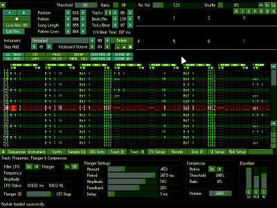

ProTrekkr is a tracker program combining a software synthesizer together with
a traditional samples tracker which can (mainly) be used to create electronic music
(like psytrance, trance goa, hard acid, IDM, chip, techno, jungle, etc.)
targeting small sized intros, demos or games.

It’s a heavily modified version of the old NoiseTrekker 2 which was made by
Juan Antonio Arguelles Rius aka Arguru.

Currently the tracker is available on Windows, Linux, FreeBSD, NetBSD, Amiga OS4, AROS, Mac OSX and Haiku OS.

