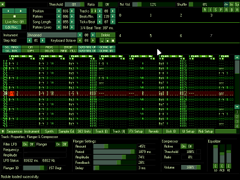

ProTrekkr is a tracker program combining a software synthesizer together with
a traditional samples tracker which can (mainly) be used to create electronic music
(like psytrance, trance goa, hard acid, IDM, chip, techno, jungle, etc.)
targeting small sized intros, demos or games.

It’s a heavily modified version of the old NoiseTrekker 2 which was made by
Juan Antonio Arguelles Rius aka Arguru.

Currently the tracker is available on Windows, Linux, FreeBSD, NetBSD, Amiga OS4, AROS, MorphOS, Mac OS (ppc, x86, x64 & arm64) and Haiku OS.  
Standalone replay routines are available for most of these Operating Systems and also for the PlayStation Portable & PlayStation Vita. 

---
> [!CAUTION]
> **The tracker itself requires AT LEAST a 1,5ghz processor to run properly.**  
**This is a FREEWARE tool, this means that you can use it for whatever you want and for free.**
**There's NO GUARANTEE that this program will perform well or even run on your computer.**
---
In order to compile the tracker, use the provided makefile for your target architecture (if available).

Example:

make -f makefile.linux

The executable will be created in the release/ptk directory.

Notice that you'll need the SDL 2 (https://github.com/libsdl-org/SDL/tree/SDL2) dev library to compile the tracker, the replay routines themselves have no dependencies. 
> [!CAUTION]
> **"ptk_vx.x.x_macosx_x86_64_ogl.zip" may be problematic on some 64 bit versions of Mac OS (ulterior to Catalina), on those you should use "ptk_vx.x.x_macosx_x86_64.zip" instead.**
---
So far, ProTrekkr was used in these intros or demos (the ones i'm aware of, at least):  
<a href="http://www.pouet.net/prod.php?which=51129" target=_parent>Nebula by Sqny</a> 
<a href="http://www.pouet.net/prod.php?which=51286" target=_parent>Kaivo by Clrsrc</a> 
<a href="http://www.pouet.net/prod.php?which=52876" target=_parent>Kaolin beach2009 by Kaolin</a> 
<a href="http://www.pouet.net/prod.php?which=53473" target=_parent>Genesis cracktro by Genesis & Nooon</a> 
<a href="http://www.pouet.net/prod.php?which=53496" target=_parent>Arjttdoasw by Mayhem</a> 
<a href="http://www.pouet.net/prod.php?which=53897" target=_parent>Ediacara by Traction</a> 
<a href="http://www.pouet.net/prod.php?which=54430" target=_parent>Hatred crackmo.short by Hatred & Neural</a> 
<a href="http://www.pouet.net/prod.php?which=54589" target=_parent>Primitive by Brainstorm</a> 
<a href="http://www.pouet.net/prod.php?which=55302" target=_parent>Mozog by Mayhem</a> 
<a href="http://www.pouet.net/prod.php?which=55505" target=_parent>Buenzli 19 invitation by clrsrc</a> 
 Also some sampled tune from the tracker has been used in the end part of this Atari ST demo :  
<a href="http://www.pouet.net/prod.php?which=50486" target=_parent>Morphonic lab.VI by checkpoint</a> 
 And a module done by BitArts (Norbert Röcher) with the tracker (in MP3 format): <a href="https://hitchhikr.net/bitarts%20-%20nightflight.mp3" target=_parent>NightFlight</a>
  Some more music also produced with the tracker:  
<a href="https://alonetone.com/TalkOrBell/tracks/crystal-quagmire" target=_parent>Crystal Quagmire by TalkOrBell</a> 
<a href="https://soundcloud.com/defraq79/distorted-reality" target=_parent>Distorted Reality (2009) by Defraq79</a> 
<a href="https://soundcloud.com/defraq79/distorted-reality-2" target=_parent>Distorted Reality by Defraq79</a> 
<a href="https://soundcloud.com/defraq79/sign" target=_parent>Sign by Defraq79</a> 
<a href="https://soundcloud.com/defraq79/back-to-moon" target=_parent>Back To Moon by Defraq79</a> 
<a href="https://soundcloud.com/defraq79/starburst" target=_parent>Starburst by Defraq79</a> 
<a href="https://soundcloud.com/daniel-human/robocop" target=_parent>Robocop by Fabulous Dazaster</a> 
<a href="https://soundcloud.com/daniel-human/akira-julliet" target=_parent>Akira & Julliet by Fabulous Dazaster</a> 
<a href="https://soundcloud.com/daniel-human/robot-revolution" target=_parent>Robot Revolution by Fabulous Dazaster</a> 
<a href="https://soundcloud.com/daniel-human/q-1" target=_parent>Q by Fabulous Dazaster</a> 
<a href="https://soundcloud.com/daniel-human/acid" target=_parent>Acid by Fabulous Dazaster</a> 
<a href="https://soundcloud.com/daniel-human/drum-n-bass-january-2016" target=_parent>Drum N Bass by Fabulous Dazaster</a> 
<a href="https://soundcloud.com/waxing-and-waning/the-world-is-czars-5th-iteration" target=_parent>The World Is Czars - 5th Iteration by Waxing And Waning</a> 
 And some videos:  
<a href="https://www.youtube.com/watch?v=_GqFWlDcXZk" target=_parent>This Is What You Get by Dolmancé</a> 
<a href="https://www.youtube.com/watch?v=dy-se36OgN4" target=_parent>Artificially Sanctified by Dolmancé</a> 
<a href="https://www.youtube.com/watch?v=Rbt77nP80CM" target=_parent>Climax by Dolmancé</a> 
<a href="https://www.youtube.com/watch?v=ixi4TQYFNDE" target=_parent>I'd Rather Die Than Go Back There ! by Dolmancé</a> 
<a href="https://www.youtube.com/watch?v=N5Hr4uiPAZk" target=_parent>Crutokk by Vojta Nedved</a> 
<a href="https://www.youtube.com/watch?v=XMvkCSP4eEs" target=_parent>Horse Heads and Gray Biscuits by Man With No Alias</a>